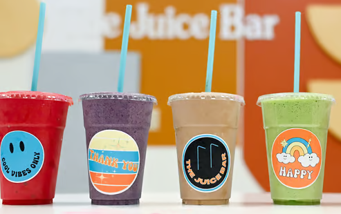

# Welcome to the Jamba Juice Bar®

This demo is about building a **Streaming Data Warehouse** for a fictitious company, Jamba Juice, based on [Spark Structured Streaming](https://github.com/apache/spark) and [Delta](https://github.com/delta-io/delta).

**Motivation:** You run a smoothie shop, but really want to keep track of your sales - in real-time!

## Inspiration for this project

*Disclaimer:* This project has taken inspiration (and code) from the [streaming-sales-generator](https://github.com/garystafford/streaming-sales-generator) project.

## Local PySpark dev environment

This repo provides everything needed for a self-contained, local PySpark single node cluster, including a Jupyter notebook environment.

It uses [Visual Studio Code](https://code.visualstudio.com/) and the [devcontainer feature](https://code.visualstudio.com/docs/devcontainers/containers) to run the Spark/Jupyter server in Docker, connected to a VS Code dev environment frontend.

## Requirements

Follow the following installation guide for *pyspark-devcontainer* from this project: https://github.com/jplane/pyspark-devcontainer

- Install [Docker Desktop](https://www.docker.com/products/docker-desktop/)
- Install [Visual Studio Code](https://code.visualstudio.com/download)
- Install the [VS Code Remote Development pack](https://marketplace.visualstudio.com/items?itemName=ms-vscode-remote.vscode-remote-extensionpack)
